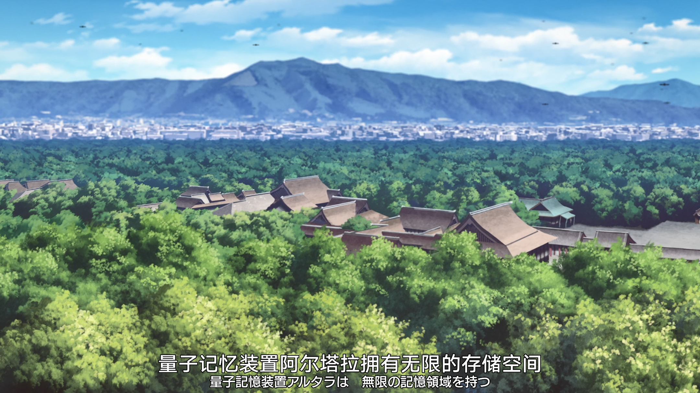
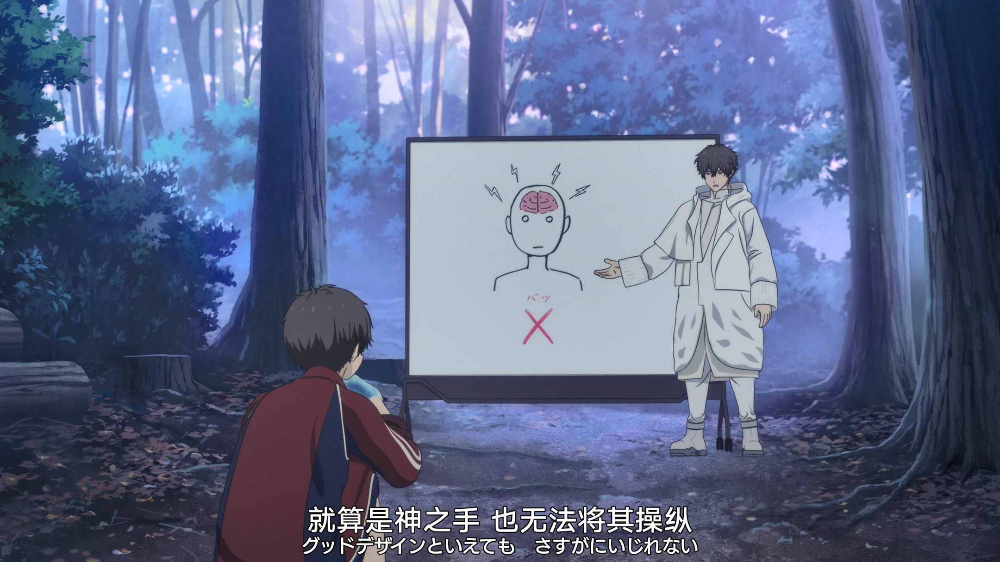
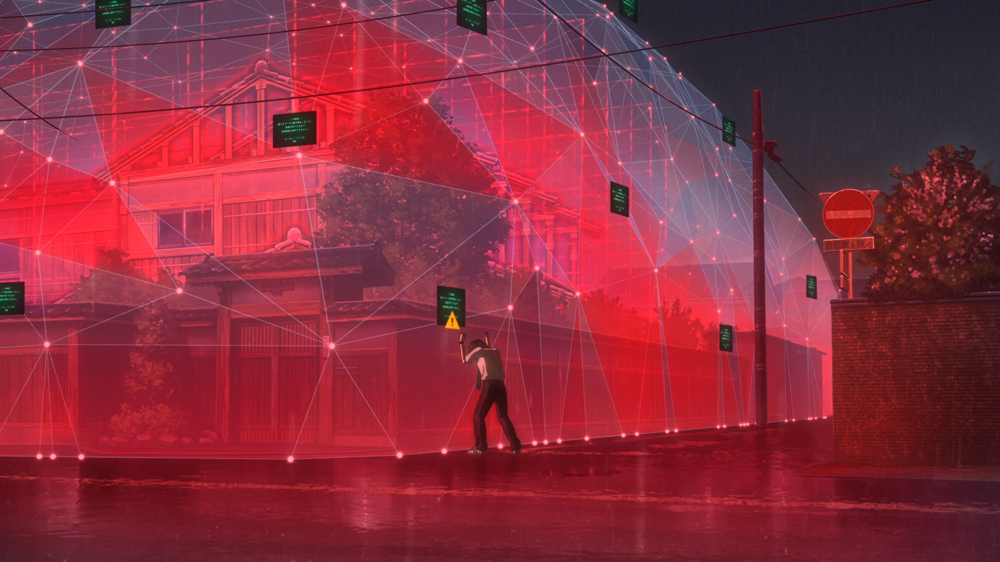

剧透警告！（到底是不是图灵机呢(๑•̀ㅂ•́)و✧
<!-- more -->

不说废话，开始胡扯。

---

### 引理1

阿尔塔拉拥有无限的存储空间

### 引理2

阿尔塔拉内部可以自行发生修改

### 引理3

虽然阿尔塔拉内部不可以修改人脑中的信息，却可以模拟人脑运行

### 推论1

由前三条引理可以得到，在阿尔塔拉内部可以模拟未来的运行，且阿尔塔拉内部的“未来”可以干涉阿尔塔拉内部的“过去”。

### 引理4

阿尔塔拉内部出现逻辑错误时，系统会立刻自动修正，但无法修正人脑

### 证明（胡扯）

不妨取$A_{TM}$的一个问题实例为$<M, w>$，在阿尔塔拉内部的一个时间点$t$，开始，一方面断言该问题的回答为拒绝，另一方面开始在阿尔塔拉中模拟$M$在$w$上运行，如果发现其在时间$t'$被接受，可以根据推论1干涉时间点$t$的断言，由于该干涉会导致逻辑错误的产生，于是根据引理4，阿尔塔拉系统会出现自动修正。

于是在阿尔塔拉开始模拟该问题后，便可以根据时间$t$处，人脑信息是否发生变化，判断该问题是否属于$A_{TM}$，即在时间$t$便判定了$A_{TM}$，于是阿尔塔拉拥有超过图灵机的计算能力。

---

