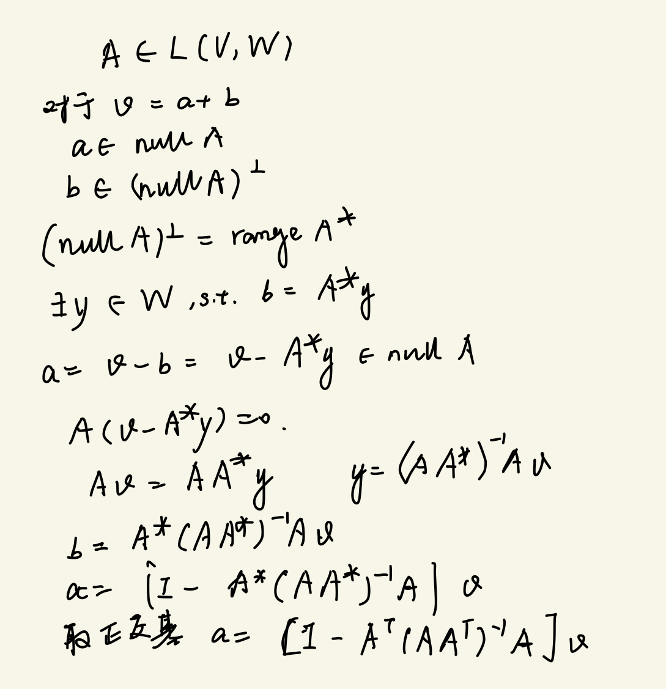

不知道为什么标题不能有空格，只能换成驼峰命名法了。

<!-- more -->

读了前7章，就当复习了一下线性代数吧，但这书几乎只关注了 operator 的内容，导致大部分课程中线性代数的内容和它交集不是很大，也可能是我还没领悟到怎么自然地扩展它。

不过令人高兴的是，我会求投影算子了（

希望能有机会把后面3章读完。

这次逼着自己在读的时候记了点笔记（抄了抄书），放在下面，免得丢了...

[pdf](./lg.pdf)


