人工智能复习...

---

## 机器学习

### 常见方法

1. 当前人工智能研究的热点之一就是机器学习。常见的机器学习方法课分为**决策树学习、神经网络、蚁群算法、粒子群算法和遗传算法**等。一个机器学习系统应该有**环境、知识库、学习环节和执行环节**四个基本部分组成。
   1. 决策树是一种知识概念表示方法，能表示与或规则；是一种**图形表示的监督学习方法**。而人工神经网络（ANNs）是**非图形符号表示法，又是一种函数表示法**；即从大量的数据中学习值为**实数、离散值或向量的函数**。人工神经网络对于训练数据中『错误』数据的错误健壮性很好。人工神经网络的训练学习过程中有一个称为『学习速率 n』的常数，n取值过大会引起**漂移**，n 取值过小会**收敛速度太慢，学习效率不高**。大量的数据中抽取规则函数，错误健壮性很好。

## 人工智能

多层神经网络的学习过程中有一种是**反向传播算法**（Back Propagation-BP）， 其基本思想是利用输出单元的误差再计算上一层单元的误差，以次向上传播以次向上传播，俗称反向传播。又称逆推学习算法。

### 人工智能的本质
研究人类智能活动的规律，构造具有一定智能行为的系统。

### 研究人工智能的途径

#### 符号主义
人类智慧基本单元是符号

#### 联结主义
人类智慧基本单元是神经元

### 人工智能大师
Alan Turing

Marniv Lee Minsky

John McCarthy

Herbert A. Simon

Allen Newell

Richard M. Karp

Feigenbaum

Raj Reddy

## 产生式系统

一种存储知识的方法

构成产生式系统的基本元素有**综合数据库、规则库、控制系统**，控制策略按执行规则的方式分类，分为**正向、逆向、双向**三类。

### 归结

归结过程中控制策略的作用是给出控制策略，以使仅对选择合适的子句间方可做归结，**避免多余的、不必要的归结式**出现。常见的控制策略有**线性归结策略、支持集策略、单元归结策略、输入归结策略**。

### 图搜索策略

为了探索产生式系统，如何搜索假设空间

#### 宽度有限搜索

完备的（指存在解就一定能找到）

#### 深度优先搜索

不完备的，如果存在无限分支

#### 启发搜索

估价函数是这种样子的时候成为 A 算法，$f(n) = g(n) + h(n)$

$g(n)$ 表示$s$到$n$的实际距离, $h(n)$表示$n$到$t$的估价

$h=0$ 宽度优先搜索

$g=0$最佳有限搜索

$h=g=0$随机搜索

$h \leq h^*$时称为$A^*$算法

## 与或图搜索

decision tree 是一种与或图, 每条路径是一个与关系, 路径之间是或关系

### 能解结点

1. 终结点可解
2. 或关系中有一个可解
3. 与关系都可解

### 极大极小搜索

对于游戏定义一个统一的估价函数.

一方进行Max,另一方进行MIn

#### $\alpha-\beta$ 剪枝

如今终于看懂了这个东西...

维护一个interval

Max结点把小于 $\alpha$ 的减掉

Min 结点把大于$\beta$ 的减掉

有一个优化就是用第一个枝的价值去 min/max 一下参数.

(哪端破坏的区间就叫对应名字的剪枝)

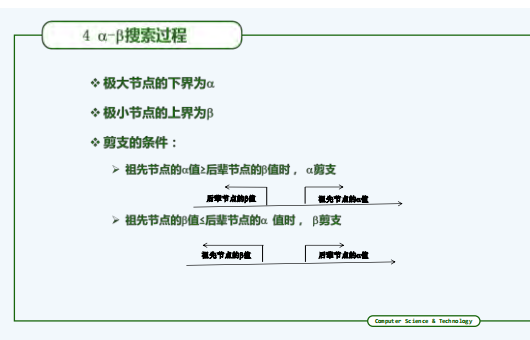

## 谓词演算

(这似乎是最友善的东西了吧)

这里直接考虑证明问题

1. 把证明目的取反, 然后证明存在矛盾
2. 大家都转 Skolem normal form
3. 转换成子句集
4. 开始通过置换进行归结
5. 画归结树

### Skolem normal form

1. 去掉 $\rightarrow$ 和 $\leftrightarrow$
2. 把~放到里面
3. 把约束变量换名字(似乎容易忘记哎)
4. 谓词前提
5. 用函数代替$\exists$

### 子句集

转合取范式

break 成一个集合

在**不可满足**下close(汉语咋说不太知道呀, 保持性质?)

### 置换

下面的替换成上面的

定义每太看明白呀, 似乎是下面的不能放到上面(???)

### 归结树

画去画去

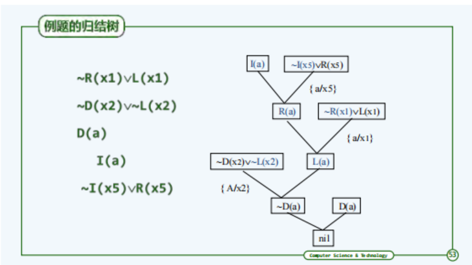

## 知识的表示方法

感觉跟看野史一样, 不对, 是黑历史

### 逻辑表示法

就离散数学的题目

### 产生式规则

高级一些, (吗?)

感觉也不高级

### 语义网络

用有向边来表示关系

边可以表示**类属**关系(别的能不能呢0.0) 例如 is a, belongs to

有两种推理方式 **匹配**, **继承**.

#### 与知识图谱的区别

可以理解成知识图谱是完整之后cherrypick给人看的语义网络(?)

毕竟他们的目的不同

## 不确定性推理

前一章应该讲故事而不是严谨

这一章应该严谨而不是讲故事

可惜都不沾

### Bayes 网络

用于 **因果推理(求后验), 诊断推理(求likelihood), 辩解推理(杂烩)**

DAG+CPT(conditional probability table)

#### D-separate

推荐看看 https://zhuanlan.zhihu.com/p/274314301

如果A到B的无向路径中存在至少一个下面的独立情况, 那么就是separate的!

注意 converging 需要考虑后续结点

##### Linear

X->Y->Z

确定Y之后X就与Z独立了!

##### Diverging

Z -> X

Z -> Y

如果固定Z, 那么X, Y 就独立了!

##### Converging

X -> Z

Y -> Z

如果固定Z, X与Y就**不**独立了!

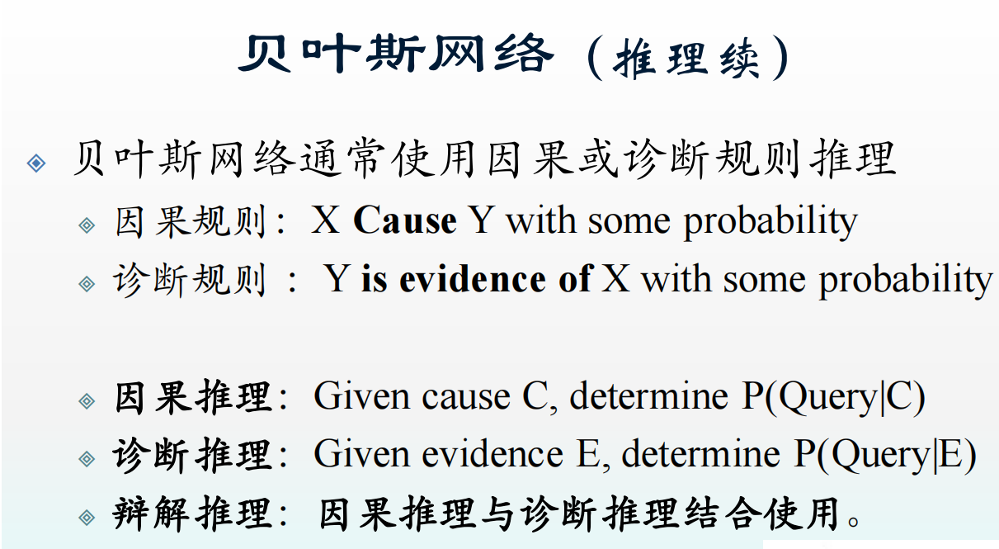

注意因果推理和诊断推理的区别

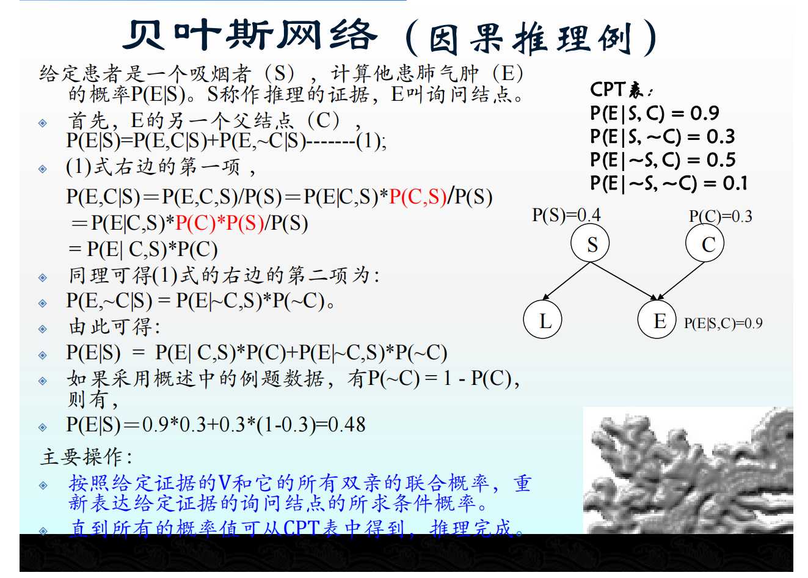

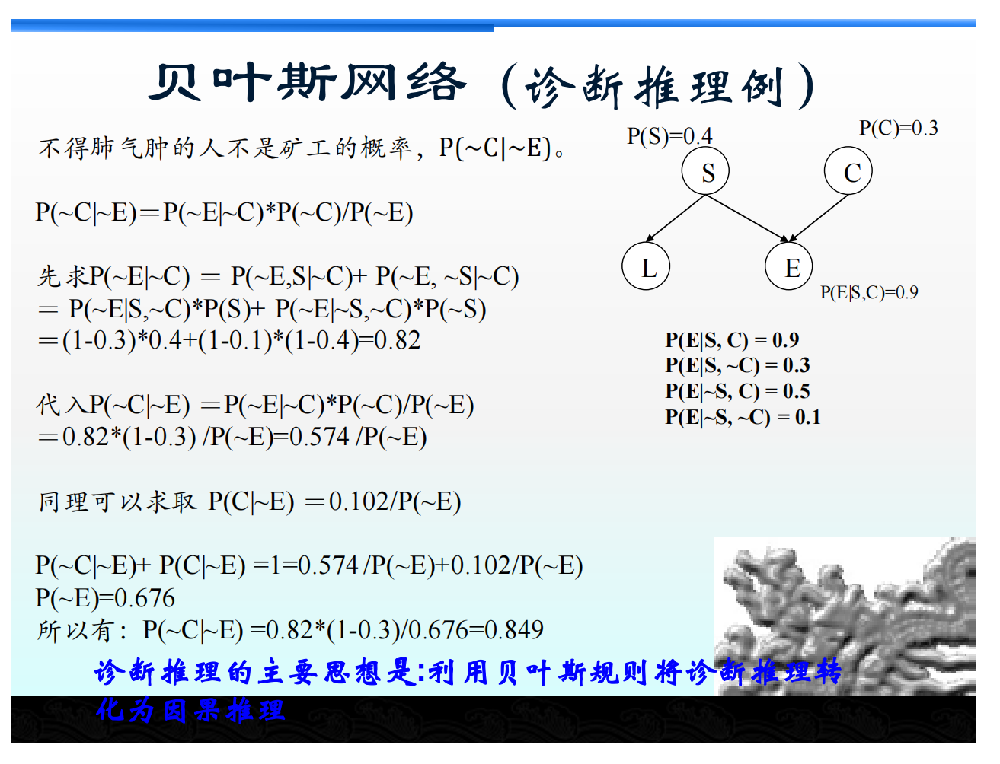

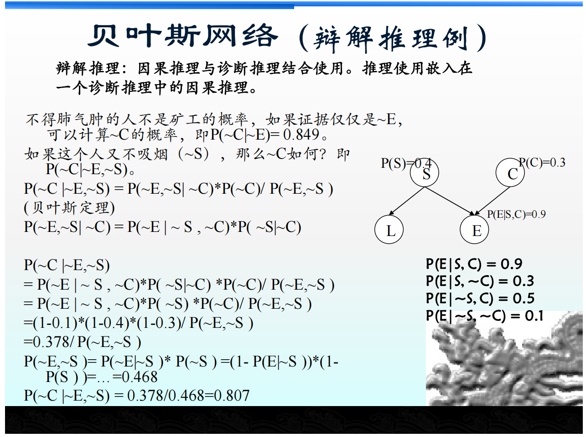

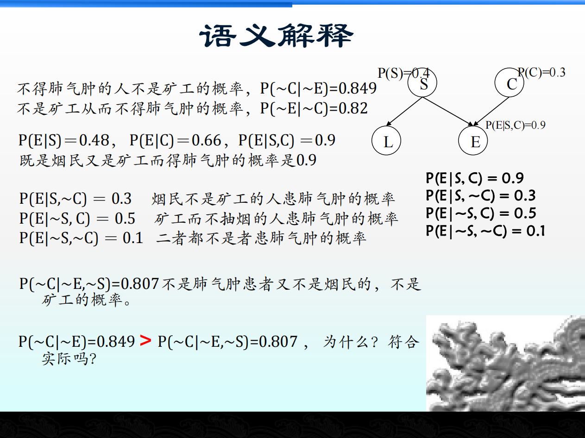

### 主观贝叶斯方法

这位更是重量级

普通Bayes考虑的是A影响B

这里考虑的是如果A不发生捏

定义几率函数 

$$O(A) = \frac{P(A)}{P(\bar{A})}$$ 

$LS = \frac{P(A|B)}{P(\bar{A}|B)} = \frac{O(B|A)}{O(B)}$

"A为真时, 对B的影响"

$$LN = \frac{P(A|\bar{B})}{P(\bar{A}|\bar{B})} = \frac{O(B|\bar{A})}{O(B)}$$

"A为假时, 对B的影响"

然后就有了如下奇妙关系 $O(B|A) = LS\times O(B)$, $O(B|\bar{A}) = LN \times O(B)$

注意$O$其实也代表概率值, 可以类似理解, 单调的

考虑 A' -> A

如果 $P(A|A') = 1$, 

$$P(B|A') = P(B|A) = \frac{LS \times P(B)}{(LS - 1) \times P(B) + 1} $$

如果 $P(A|A') = 0$

$$P(B|A') = P(B|\bar{A}) = \frac{LN\times P(B)}{(LN - 1)\times P(B) + 1}$$

如果 A 与 A' 独立

$P(B|A') = P(B)$

于是可以线性插值了!

还有另外的事情, $O(B|A_1A_2) = \frac{O(B|A_1)}{O(B)}\frac{O(B|A_2)}{O(B)}O(B) == LS_1 LS_2 O(B)$

确实也挺nb的

改观了!

#### 练习题

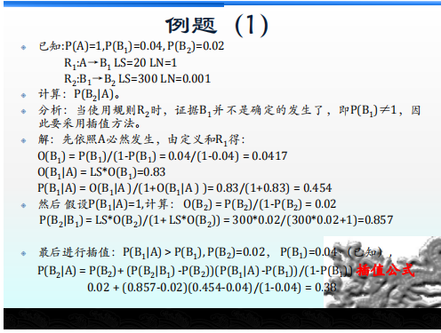

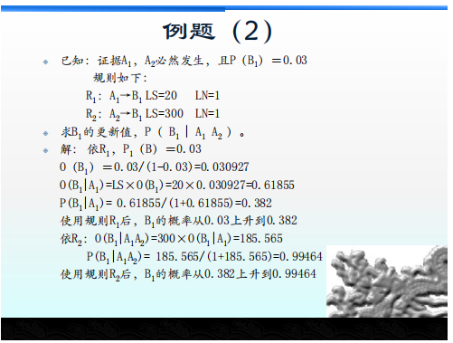

### 确定性方法

$$CF(B, A) = MB(B, A) - MD(B,A)$$

$CF(B, A) \in [-1, 1]$, 如果$CF(B,A) = 1$, A发生B一定发生

如果$CF(B, A) = -1$, A发生B一定不发生

1. 计算的时候先算 and or 

2. 再进行合成

合成公式

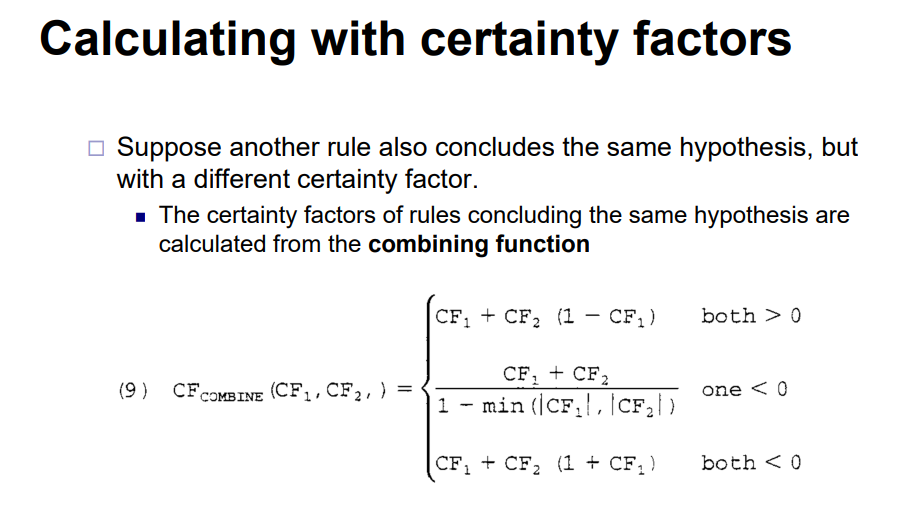

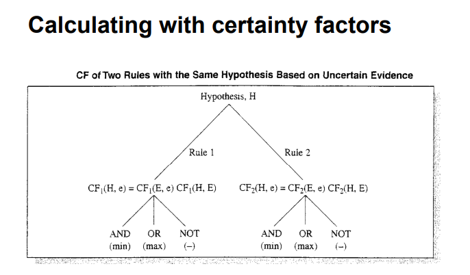

#### 练习题

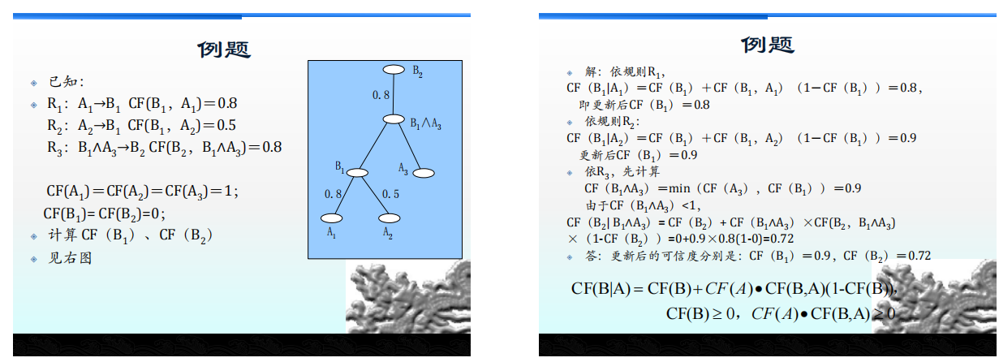

### Evidence theory

概率分配函数

$$m: 2^U \rightarrow [0, 1]$$

s.t.

$m(\phi) = 0$

$\sum_{A \in 2^U} mu(A) = 1$

信任函数

$Bel(A) = \sum_{B \subseteq A} m(A)$

似然函数 PI

$PI(A) = 1 - Bel(\bar{A})$

## 遗传算法

1. 不受函数形式的限制, 例如不需要它可导
2. 全局优化
3. 概率方法自动搜索状态空间
4. 并行
5. 黑盒

### 形式

1. 复制
2. 交叉
3. 变异

轮盘选择

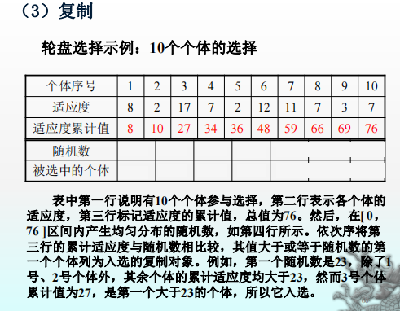

复制率, 突变率

## 群智能

无智能或简单智能的主体通过任何形式的聚集协同而表现出智能行为的特性。

### 蚁群算法

#### 要素

1. 觅食规则
2. 移动规则
3. 避障规则
4. 信息素规则
5. 范围
6. 环境

#### 应用

1. 聚类问题
1. 路由算法设计
1. 图着色

### 粒子群算法

#### 概念

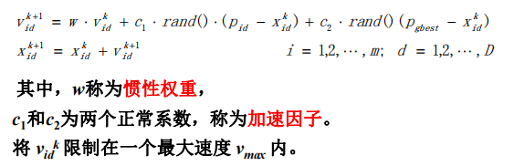

### 人工鱼群算法

#### 要素

1. 聚集行为
2. 觅食行为
3. 跟随行为
4. 移动行为

## NLP 

### 其他名字
自然语言理解

### 困难

1. 歧义

各种歧义，例如读音，分词等等

注音歧义，分词歧义，词义歧义，语用歧义

2. 病构
现实环境中可能不遵守语法

### 方法论

#### 理性主义
基于对语法的描述

基于规则

属于结构主义

#### 经验主义

需要引入随机性，复杂的概率模型

属于功能

### NLP的过程，任务和瓶颈

#### NLP 的过程
1. 语言输入技术

语音识别，字符识别，手写识别

2. 语言处理技术

abab

3. 语言输出技术

文本到语音

定制文档

#### NLP 的瓶颈

理解语言的过程是动态的

NLP的知识大多是归纳的

NLP非确定性过程

### 统计语言模型

成为主流

规范的语言与非规范的语言直接没有明确的界限

利用概率模型

